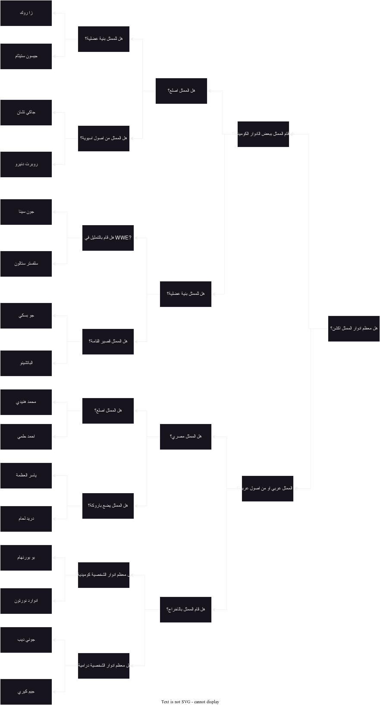
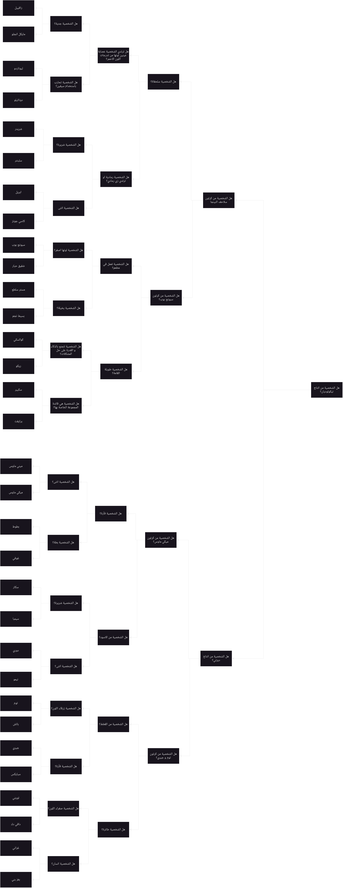
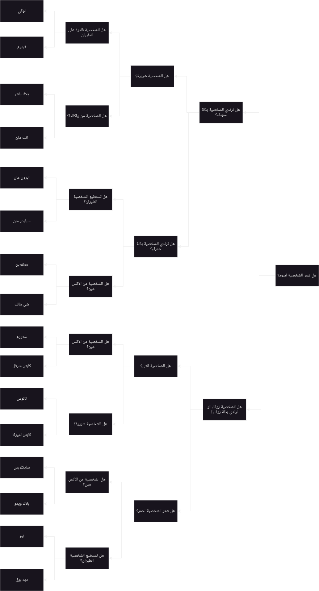

# test-your-character
A mini character-guessing program using deterministic logic using Experta.

While the decision trees below are in Arabic, the program UI is in English.
## Requirements
- Python 3.8.x
- experta
- pyautogui
# License
[Unlicense](./LICENSE)

# Desicion Trees
## Actors Tree

## Cartoons Tree

## Ficion Tree

## Marvel Tree
